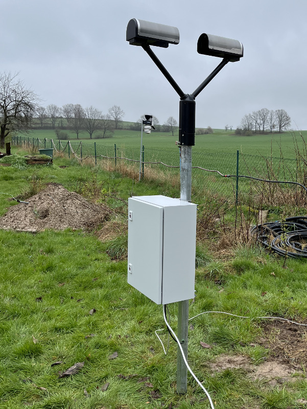

# weewx-precipmeter
WeeWX service to fetch data from disdrometers or present weather sensors
like Ott Parsivel<sup>2</sup> or Thies LNM

Please note: Actually the TCP connection is tested only.

<p align="center"></p>

## Prerequisites

### Hardware

#### General

In general you need:
* a disdrometer or present weather sensor like Ott-Hydromet
  Parsivel<sup>2</sup> or Thies LNM
* a converter from RS485 to whatever your computer understands
  (RS485-to-ethernet converter or RS485-to-USB converter)
* a 24V DC power supply (I recommend using a model including an accumulator
  for uninterupted supply)
* in case you want to use WLAN a WLAN adapter
* an electric cabinet for outdoor usage to put the power supply and the
  converter(s) in
* cable glands, wires, connectors etc.

#### Parts list

For example I used the following components:

item | amount | description | manufacturer |
----:|-------:|-------------|--------------|
01   | 1 pc.  | laser disdrometer Parsivel<sup>2</sup> | Ott Hydromet GmbH |
02   | 1 pc.  | Com-Server++ 58665 | Wiesemann & Theis GmbH |
03   | 1 pc.  | 9 pin sub-D connector female 11904 | Wiesemann & Theis GmbH |
04   | 1 pc.  | power supply APU230V.24V-6A/20Ah *) | Rinck Electronics Germany GmbH |
05   | 1 pc.  | electric cabinet AX | Rittal |
06   | 2.33 m  | pipe 2" | |

*) If the grid power is more reliable at your location than at mine,
   you can order that power supply with a smaller accumulator.

#### Wiesemann & Theis Com-Server++

This is one possible means to connect the disdrometer to the computer. To use it
you have to set up the Com-Server++ to RS485 2-wire communication. Open
the device as described in the manual and set the DIP switches as follows:

SW1 | SW2 | SW3 | SW4 | SW5 | SW6 | SW7 | SW8
----|-----|-----|-----|-----|-----|-----|-----
ON  | ON  | OFF | OFF | OFF | ON  | ON  | OFF

2 pins of the sub-D connector are used only:

* pin 2: RxD A/-
* pin 7: RxD B/+

 

If the distance between the Com-Server++ and the disdrometer is not
short or both devices are connected to different power supplies, 
you additionally need an isolator. In case of doubt see the user's
manual of the disdrometer for requirements. Please note, that
you alone are responsible for what you do.

### Software

* WeeWX (of course)
* SQLite3
* python3-configobj
* python3-requests (if the device offers a restful service)
* python3-serial (if the device is connected by USB or serial)


## Installation instructions

1) download

   ```
   wget -O weewx-precipmeter.zip https://github.com/roe-dl/weewx-precipmeter/archive/master.zip
   ```

2) run the installer

   ```
   sudo wee_extension --install weewx-precipmeter.zip
   ```

3) edit configuration in weewx.conf

   Before using this extension you have to set up which devices
   to be queried and which variables to be fetched. See
   section "Configuration" for details.

   **Caution!** If you want to save the readings to a separate 
   database and have it created properly, you have to edit
   the configuration file before you **first** start WeeWX
   after installing the extension. 

   If you want to add additional variables afterwards you have to 
   extend the database schema manually by using the
   `wee_database` utility. This is **not** done automatically.

5) restart weewx

   ```
   sudo /etc/init.d/weewx stop
   sudo /etc/init.d/weewx start
   ```

## Configuration

It is possible to configure more than one device. 

### General options

* `enable`: If True or omitted, retrieve data from that device.
  If False, that subsection is not used. (optional)
* `log_success`: If True, log successful operation. 
  If omitted, global options apply. (optional)
* `log_failure`: If True, log unsuccessful operation. 
  If omitted, global options apply. (optional)
* `data_binding`: data binding to use for storage
* `weathercodes`: device to get present weather codes from
  (use the section name of the device configuration section)
* `visibility`: device to get `visbility` reading from
  (use the section name of the device configuration section)
* `precipitation`: Generally the readings of `rain` and `rainRate` are not 
  provided by this extension but by the driver that is set
  up by the `station_type` key in the `[Station]` section
  of weewx.conf. In case you want this extension to provide
  `rain` and `rainRate` you can set up `precipitation`
  to point to the device subsection of the device you want to get 
  the readings from.
  Default is not to provide `rain` and `rainRate`.


### Connection configuration

* `host`: host name or IP address of the device to get data from
* `port`: port number
* `timeout`: request timeout (optional, default is 0.5s)
* `retries`: request retries (0 is no retries) (optional, default is
   no retries)
* `query_interval`: query interval (optional, default 5s)

### Authentication configuration

Actually none.

### Device configuration

* `model`: device model (actually `Ott-Parsivel1` or `Ott-Parsivel2`)
* `prefix`: observation type name prefix (default `ott`)
* `telegram`: telegram configuration string as set up in the device
  (Instead of this key a `[[[loop]]]` sub-subsection can be used 
  to define the observation types measured by the device.)
* `field_separator`: data field separator. Optional. Default is `;`.
* `record_separator`: data record separator. Optional. Default is `\r\n`

See [WeeWX Customization Guide](http://www.weewx.com/docs/customizing.htm#units)
for a list of predefined units and unit groups.

The observation types are automatically registered with WeeWX.


### Accumulators

**Note**: This section is about WeeWX accumulators and their use
together with this extension. For the internal accumulation 
because of different data intervals see the 
[wiki page](https://github.com/roe-dl/weewx-precipmeter/wiki/How-different-data-intervals-are-handled-within-this-extension).

Accumulators define how to aggregate the readings during the
archive interval.
This extension tries to set up reasonable accumulators. If
they do not work for you, you can set up accumulators manually
in the `[Accumulator]` section of `weewx.conf`.
See [WeeWX Accumulators wiki page](https://github.com/weewx/weewx/wiki/Accumulators)
for how to set up accumulators in WeeWX.

The accumulator `firstlast` does not work for numeric values of this
extension. The reason is that the database schema within this extension
includes all numeric values in the list of daily summeries tables. But
WeeWX let you have an observation type either with a daily summeries
table or the `firstlast` accumulator, not both.

Additionally the accumulator 'firstlast' as of version 4.10.2 converts
all values to strings. So it is not suitable for values other than
strings (like numbers or lists), anyway. 

For the present weather `ww` and `wawa` this extension includes its
own accumulator. It omits readings that are opposite to the readings
before and after. This is because the propability of error ist about
3%. That is quite frequent. So it is handled specially.

### Example configuration

```
...

[DataBindings]
    ...
    # additional section for an extra database to store the disdrometer data
    # optional!
    [[precip_binding]]
        database = precip_sqlite
        table_name = archive
        manager = weewx.manager.DaySummaryManager
        schema = user.precipmeter.schema

[Databases]
    ...
    # additional section for an extra database to store disdrometer data
    # optional!
    [[precip_sqlite]]
        database_name = precipmeter.sdb
        database_type = SQLite

[Engine]
    [[Services]]
        data_services = ..., user.precipmeter.PrecipData
        archive_services = ..., user.precipmeter.PrecipArchive

[PrecipMeter]
    data_binding = precip_binding
    weathercodes = Parsivel # or Thies
    visibility = Parsivel # or Thies
    [[Parsivel]]
        enable = True # or False
        model = Ott-Parsivel2
        prefix = ott
        telegram = "%13;%01;%02;%03;%07;%08;%34;%12;%10;%11;%18;/r/n"
        type = tcp # udp tcp restful usb none
        host = replace_me
        port = replace_me
    [[Thies]]
        enable = True # or False
        model = Thies-LNM
        prefix = thies
        type = tcp # udp tcp restful usb 
        host = replace_me
        port = replace_me
    [[GenericDevice]]
        enable = True # or False
        model = generic
        type = tcp # udp tcp restful usb
        host = replace_me
        port = replace_me
        field_separator = replace_me
        record_separator = replace_me
        [[[loop]]]
            [[[[obs1]]]]
                name = replace_me # observation type name
                unit = replace_me # supplied unit
                group = replace_me # unit group
                sql_datatype = replace_me # REAL, INTEGER, VARCHAR(...)
                description = replace_me # observation type description
            [[[[obs2]]]]
                name = replace_me # observation type name
                unit = replace_me # supplied unit
                group = replace_me # unit group
                sql_datatype = replace_me # REAL, INTEGER, VARCHAR(...)
                description = replace_me # observation type description
            ...

```

## Observation types

### General observation types

* `ww`: present weather code according to WMO table 4677, enhanced by
  this extension
* `wawa`: present weather code according to WMO table 4680, enhanced by
  this extension
* `presentweatherStart`: timestamp of the beginning of the present weather
* `presentweatherTime`: time elapsed since last change of the present weather
* `precipitationStart`: timestamp of the beginning of the present
  precipitation period or `None` if actually no precipitation takes place.
* `visibility`: visibility, derived from `MOR`

To convert the present weather code into a symbol or icon
look for the `$presentweather` tag provided by
[weewx-DWD](https://github.com/roe-dl/weewx-DWD).

Example of weather icons supplied by `$presentweather`:
drizzle | rain | hail | rain and snow | snow | 
--------|------|------|---------------|------|
 | |  |  |  | 

The observation types `ww`, `wawa`, `presentweatherStart`, and
`presentweatherTime` are derived from the device that is set
by the `weathercodes` key. The observation type `visibility`
is derived from the device that is set by the `visibility`
key. If the configuration keys `weathercodes` or `visibility`
are omitted or point to an unknown subsection, the respective
observation types are omitted.

### Ott Hydromet Parsivel and Parsivel<sup>2</sup>

Those observation type names are prepended by the prefix defined in
`weewx.conf`. Default is `ott`.

* `SNR`: serial number of the device
* `queryInterval`: 
* `sensorState`: 0 - ok, 1 - dirty but measurement is still possible,
  2 - dirty, no measurement possible, 3 - laser defective
* `errorCode`:
* `wawa`: present weather code according to WMO table 4680
* `ww`: present weather code according to WMO table 4677
* `METAR`: present weather code according to WMO table 4678
* `NWS`: present weather code according to NWS
* `rainRate`: rain rate
* `rainAccu`: accumulated rain since power-on
* `rainAbs`: absolute amount of rain
* `snowRate`: snow intensity
* `dBZ`: radar reflectivity factor
* `MOR`: meteorological optical range (visibility) in precipitation
  (This reading does not report fog induced visibility reduction.)
* `raw0000` to `raw1023`: raw data (no. 93)
* `history`: history of the present weather codes of the last
  hour. This is for debugging purposes. The internal structure of the
  value may change without notice.

### Thies LNM

Those observation type names are prepended by the prefix defined in
`weewx.conf`. Default is `thies`.

* `SNR`: serial number of the device
* `wawa`: present weather code according to WMO table 4680
* `ww`: present weather code according to WMO table 4677
* `METAR`: present weather code according to WMO table 4678
* `precipRate`: precipitation intensity (all kind of precipitation)
* `rainRate`: intensity of liquid precipitation
* `snowRate`: intensity of solid precipitation
* `rainAccu`: accumulated rain since power-on
* `dBZ`: radar reflectivity factor
* `MOR`: meteorological optical range (visibility) in precipitation
  (This reading does not report fog induced visibility reduction.)
* `history`: history of the present weather codes of the last
  hour. This is for debugging purposes. The internal structure of the
  value may change without notice.

### Present weather codes

In general disdrometers use a subset of the WMO code tables.

WMO code table 4677 ww | WMO code table 4680 w<sub>a</sub>w<sub>a</sub>
-------------------------|---------------------------
 | 

These symbols and appropriate description texts can be displayed by the
`$presentweather` tag.

## Usage in skins

### Present weather icon

If the disdrometer reports precipitation the respective icon is shown.
Otherwise an icon representing the cloud coverage according to the
forecast is shown.

```

```

### Present weather description

If the disdrometer reports precipitation the respective description
is displayed. Otherwise a description of the amount of cloud coverage
is displayed. 

Note: Without the `#if` statement the text `no cloud development`
would always be displayed in case of no precipitation.

```
#if int($current.ww.raw)==0
#set $icontxt=$presentweather(n=$hour($data_binding='dwd_binding').cloudcover.avg.raw,night=$almanac.sun.alt<0).text
#else
#set $icontxt=$presentweather(ww=int($current.ww.raw),n=$hour($data_binding='dwd_binding').cloudcover.avg.raw,night=$almanac.sun.alt<0).text
#end if
$icontxt
```

If you have a cloud coverage measuring instrument you can set `n` to
the reading of that device instead of using the forecasted value.

### Table of current disdrometer readings

Example table:

```
    <table class="table-striped">
      <tr>
        <th>Bezeichnung</th>
        <th>Größe</th>
        <th>Wert</th>
        <th>WMO</th>
        <th>Text</th>
        <th>Icon</th>
      </tr>
      <tr>
        <td>ottRainAccu</td>
        <td></td>
        <td>$current.ottRainAccu.format("%.2f")</td>
        <td></td>
        <td></td>
        <td></td>
      </tr>
      <tr>
        <td>ottRainAbs</td>
        <td></td>
        <td>$current.ottRainAbs.format("%.2f")</td>
        <td></td>
        <td></td>
        <td></td>
      </tr>
      <tr>
        <td>ottRainRate</td>
        <td></td>
        <td>$current.ottRainRate.format("%.3f")</td>
        <td></td>
        <td></td>
        <td></td>
      </tr>
      <tr>
        <td>ottSnowRate</td>
        <td></td>
        <td>$current.ottSnowRate.format("%.3f")</td>
        <td></td>
        <td></td>
        <td></td>
      </tr>
      <tr>
        <td>ottMOR</td>
        <td>MOR</td>
        <td>$current.ottMOR</td>
        <td></td>
        <td></td>
        <td></td>
      </tr>
      <tr>
        <td>ottDBZ</td>
        <td>dBZ</td>
        <td>$current.ottDBZ</td>
        <td></td>
        <td></td>
        <td></td>
      </tr>
      <tr>
        <td>ottWw</td>
        <td>ww</td>
        <td>$current.ottWw</td>
        <td>$presentweather(ww=int($current.ottWw.raw)).wmo_symbol</td>
        <td>$presentweather(ww=int($current.ottWw.raw),n=$hour($data_binding='dwd_binding').cloudcover.avg.raw,night=$almanac.sun.alt<0).text</td>
        <td></td>
      </tr>
      <tr>
        <td>ottWawa</d>
        <td>w<sub>a</sub>w<sub>a</sub></td>
        <td>$current.ottWawa</td>
        <td>$presentweather(wawa=int($current.ottWawa.raw)).wmo_symbol
        ## $presentweather(wawa=int($current.ottWawa.raw)).text
        </td>
        <td></td>
        <td></td>
      </tr>
      <tr>
        <td>ottMETAR</td>
        <td></td>
        <td>$current.ottMETAR.raw</td>
        <td></td>
        <td></td>
        <td></td>
      </tr>
      <tr>
        <td>ottNWS</td>
        <td></td>
        <td>$current.ottNWS.raw</td>
        <td></td>
        <td></td>
        <td></td>
      </tr>
      <tr>
        <td>ww</td>
        <td>ww</td>
        <td>$current.ww</td>
        <td>$presentweather(ww=int($current.ww.raw)).wmo_symbol</td>
        <td>
        #if int($current.ww.raw)==0
        $presentweather(n=$hour($data_binding='dwd_binding').cloudcover.avg.raw,night=$almanac.sun.alt<0).text
        #else
        $presentweather(ww=int($current.ww.raw),n=$hour($data_binding='dwd_binding').cloudcover.avg.raw,night=$almanac.sun.alt<0).text
        #end if
        </td>
        <td></td>
      </tr>
      <tr>
        <td>Wawa</d>
        <td>w<sub>a</sub>w<sub>a</sub></td>
        <td>$current.wawa</td>
        <td>$presentweather(wawa=int($current.wawa.raw)).wmo_symbol
        ## $presentweather(wawa=int($current.wawa.raw)).text
        </td>
        <td></td>
        <td></td>
      </tr>
      <tr>
        <td>presentweatherStart</td>
        <td></td>
        <td>$current.presentweatherStart.raw</td>
        <td></td>
        <td>$current.presentweatherStart</td>
        <td></td>
      </tr>
      <tr>
        <td>presentweatherTime</td>
        <td></td>
        <td>$current.presentweatherTime</td>
        <td></td>
        <td>$current.presentweatherTime.long_form</td>
        <td></td>
      </tr>
    </table>
```

The `$presentweather` tag is available from 
[weewx-DWD](https://github.com/roe-dl/weewx-DWD).

### Table of present weather during the last hour

If you doubt the reason for some present weather code in `ww` or `wawa`
you can inspect the `history` observation type to get a list of the
detected weather during the last hour. The following example creates
a table showing start and end of each individual weather, its
duration, the respective values of `ww` and `wawa` and - if there
is precipitation - the start time of the precipitation.
If there is no weather change during the last hour, no table is
shown at all.

In this example you also learn how to use the `ValueTuple` and
`ValueHelper` classes for calculated values in WeeWX templates.

```
#from weewx.units import ValueTuple, ValueHelper
...
    #if $len($current.ottHistory.raw)>1
    <p>Wetterzustände der letzten Stunde:</p>
    <table class="table-striped">
      <tr>
        <th>Beginn</th>
        <th>Ende</th>
        <th>Dauer</th>
        <th>ww</th>
        <th>w<sub>a</sub>w<sub>a</sub></th>
        <th>Niederschlagsbeginn</th>
      </tr>
      #for $ii in reversed($current.ottHistory.raw)
      #set $start=ValueHelper(ValueTuple($ii[0],'unix_epoch','group_time'),formatter=$station.formatter)
      #set $stop=ValueHelper(ValueTuple($ii[1],'unix_epoch','group_time'),formatter=$station.formatter)
      #set $precipstart=ValueHelper(ValueTuple($ii[4],'unix_epoch','group_time'),formatter=$station.formatter)
      #set $duration=ValueHelper(ValueTuple($ii[1]-$ii[0],'second','group_deltatime'),formatter=$station.formatter)
      <tr>
        <td>$start</td>
        <td>$stop</td>
        <td>
          #if $duration.raw>3600
          $duration.hour
          #else
          $duration.minute
          #end if
        </td>
        <td>
          $('%02d' % ii[2])
          <span style="position:relative;top:4px">$presentweather(ww=$ii[2]).wmo_symbol(width=22)</span>
        </td>
        <td>
          $('%02d' % ii[3])
          <span style="position:relative;top:4px">$presentweather(wawa=$ii[3]).wmo_symbol(width=22)</span>
        </td>
        <td>$precipstart</td>
      </tr>
      #end for
    </table>
    <p></p>
    #end if
```

Example how that table could look like:


## How to set up Ott Parsivel<sup>2</sup>?

* Open the front cover
* Connect the PC to the Parsivel<sup>2</sup> by an USB wire
* Start a terminal application on the PC
  - macOS: `screen /dev/tty.usb...`
  - Windows: 
* If the connection is working properly, a data telegram is shown
  every minute (or whatever interval is set up into the device).
* Use the commands as described in the Parsivel<sup>2</sup> manual

Note: While the USB connection is active, the RS485 interface is
not sending data.

## Troubleshooting

* `ERROR thread 'PrecipMeter-Parsivel': opening connection to XXX.XXX.XXX.XXX:XXXX failed with ConnectionRefusedError [Errno 111] Connection refused, will be tried again`

  May be there is another connection active to `XXX.XXX.XXX.XXX:XXXX`. 
  You cannot have more than one connection at the same time.

  Check the settings of the RS485 to ethernet converter. 
  * For `type = tcp`: Is the TCP server mode enabled?
  * For `type = udp`: Is sending UDP data enabled? Is the target IP address
    correct?

* No reasonable data

  Make sure the telegram string is the same at the Parsivel<sup>2</sup> 
  setting and in `weewx.conf`. To check that connect to the 
  Parsivel<sup>2</sup> by USB and enter the command `CS/L<CR>`. 
  That shows the current configuration. So you can compare.

  If you use the `[[[loop]]]` subsection, make sure it reflects the 
  Parsivel<sup>2</sup> telegram setting appropriately.
  
  Please take special care on typos.

* The database is not created properly.

  Check the key `schema` in the `[[precip_binding]]` section. It must
  be `schema = user.precipmeter.schema`. 

  Please note, that the database table is created at the very first run
  after setting up the PrecipMeter extension. If you change the settings
  afterwards, the database table schema is **not** updated. 
  That's due to how WeeWX processes databases.

* The device reports precipitation for one moment while there is no
  precipitation around.

  According to the specification about 97% of the present weather readings
  are correct. That means, up to 3% can be erroneous. So you will see
  some erroneous results, but that should be rare. Nothing can be done
  about that. It's the limitation of the device.

* Typical logging messages

  * At WeeWX start:

    ```
    May  8 14:31:00 WeatherPC weewx[1234] INFO user.PrecipMeter: PrecipMeter service version 0.3
    May  8 14:31:00 WeatherPC weewx[1234] INFO user.PrecipMeter: thread Parsivel2, host XXX.XXX.XXX.XXX, poll interval 5
    May  8 14:31:00 WeatherPC weewx[1234] INFO user.PrecipMeter: thread 'PrecipMeter-Parsivel2': TCP connection to XXX.XXX.XXX.XXX:8000
    May  8 14:31:00 WeatherPC weewx[1234] INFO user.PrecipMeter: accumulator dict for 'Parsivel2': {'ottRain': {'extractor': 'sum'}, 'ottHistory': {'accumulator': 'firstlast', 'adder': 'noop', 'extractor': 'noop'}, ...
    May  8 14:31:00 WeatherPC weewx[1234] INFO user.PrecipMeter: thread 'PrecipMeter-Parsivel2' starting
    May  8 14:31:00 WeatherPC weewx[1234] INFO user.PrecipMeter: PrecipMeter archive version 0.3
    May  8 14:31:00 WeatherPC weewx[1234] INFO user.PrecipMeter: Using binding 'precip_binding' to database 'precip.sdb'
    May  8 14:31:09 WeatherPC weewx[1234] INFO user.PrecipMeter: thread 'PrecipMeter-Parsivel2': sensor ok
    ```

  * During normal operation:

    ```
    May  8 14:35:18 WeatherPC weewx[1234] INFO user.PrecipMeter: 5 records received from Parsivel2 during archive interval
    May  8 14:40:18 WeatherPC weewx[1234] INFO user.PrecipMeter: 5 records received from Parsivel2 during archive interval
    ```

  * At WeeWX stop

    ```
    May  8 14:40:57 WeatherPC weewx[1234] INFO user.PrecipMeter: thread 'PrecipMeter-Parsivel2': shutdown requested
    May  8 14:40:59 WeatherPC weewx[1234] INFO user.PrecipMeter: thread 'PrecipMeter-Parsivel2': self.running==False getRecord() select() r [] w [] x []
    May  8 14:40:59 WeatherPC weewx[1234] INFO user.PrecipMeter: thread 'PrecipMeter-Parsivel2' stopped
    ```

## References

### Disdrometers

English:
* [OTT Hydromet Parsivel<sup>2</sup>](https://www.ott.com/en-uk/products/meteorological-sensors-26/ott-parsivel2-laser-weather-sensor-2392/)
* [user's manual OTT Hydromet Parsivel<sup>2</sup>](https://www.ott.com/en-uk/products/download/operating-instructions-present-weather-sensor-ott-parsivel2-with-screen-heating-1/)
* [Thies laser precipitation monitor](https://www.thiesclima.com/en/Products/Precipitation-measuring-technology-Electrical-devices/?art=774)

German:
* [OTT Parsivel<sup>2</sup>](https://www.ott.com/de-de/produkte/meteorologie-29/ott-parsivel2-niederschlagsbestimmung-97/)
* [Bedienanleitung OTT Parsivel<sup>2</sup>](https://www.ott.com/de-de/produkte/download/bedienungsanleitung-present-weather-sensor-ott-parsivel2-mit-glasscheibenheizung-1/)
* [Thies Laser-Niederschlags-Monitor](https://www.thiesclima.com/de/Produkte/Niederschlag-Messtechnik-Elektrische-Geraete/?art=774)

### RS485 adapters

English:
* [Com-Server++](https://www.wut.de/e-58665-ww-daus-000.php)
* [user's manual Com-Server++](https://www.wut.de/download/manual/e-5866w-10-prus-219.pdf)
* [connector](https://www.wut.de/e-11www-11-daus-000.php)
* [isolator](https://www.wut.de/e-66201-ww-daus-000.php)
* [isolator and overvoltage protection](https://www.wut.de/e-66203-ww-daus-000.php)
* [RS232-RS485 converter](https://www.wut.de/e-86201-ww-daus-000.php)
* [USB-RS485 converter](https://www.wut.de/e-38211-ww-daus-000.php)

German:
* [Com-Server++](https://www.wut.de/e-58665-ww-dade-000.php)
* [Bedienanleitung Com-Server++](https://www.wut.de/download/manual/e-5866w-10-prde-219.pdf)
* [Steckverbinder](https://www.wut.de/e-11www-11-dade-000.php)
* [Galvanische Trennung](https://www.wut.de/e-66201-ww-dade-000.php)
* [Galvanische Trennung mit Überspannungsschutz](https://www.wut.de/e-66203-ww-dade-000.php)
* [RS232-RS485-Umsetzer](https://www.wut.de/e-86201-ww-dade-000.php)
* [USB-RS485-Umsetzer](https://www.wut.de/e-38211-ww-dade-000.php)

### WeeWX

* [WeeWX website](https://www.weewx.com)
* [WeeWX information in german](https://www.woellsdorf-wetter.de/software/weewx.html)
* [WeeWX customization guide](https://www.weewx.com/docs/customizing.htm)
  (See this guide for using the observation types in skins.)
* [WeeWX accumulators](https://github.com/weewx/weewx/wiki/Accumulators)
  (This extension tries to set up reasonable accumulators for the
  observation types, but if you want them different or if they do not
  work appropriately, you can define them in `weewx.conf`)
* [Calculation in templates](https://github.com/weewx/weewx/wiki/calculate-in-templates)
